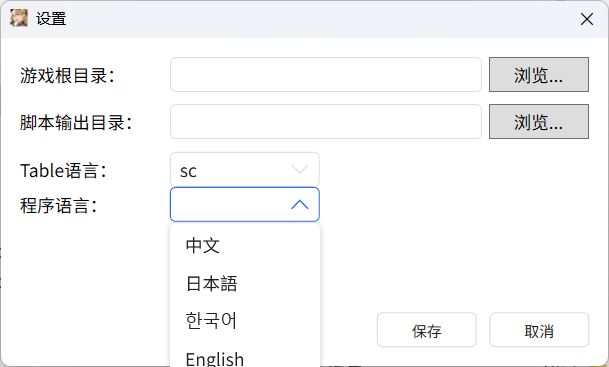
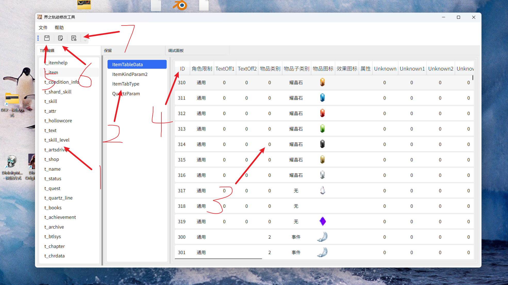
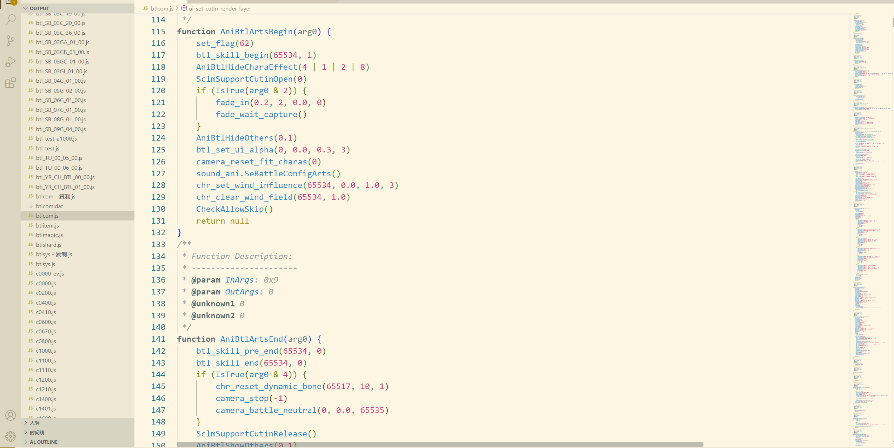
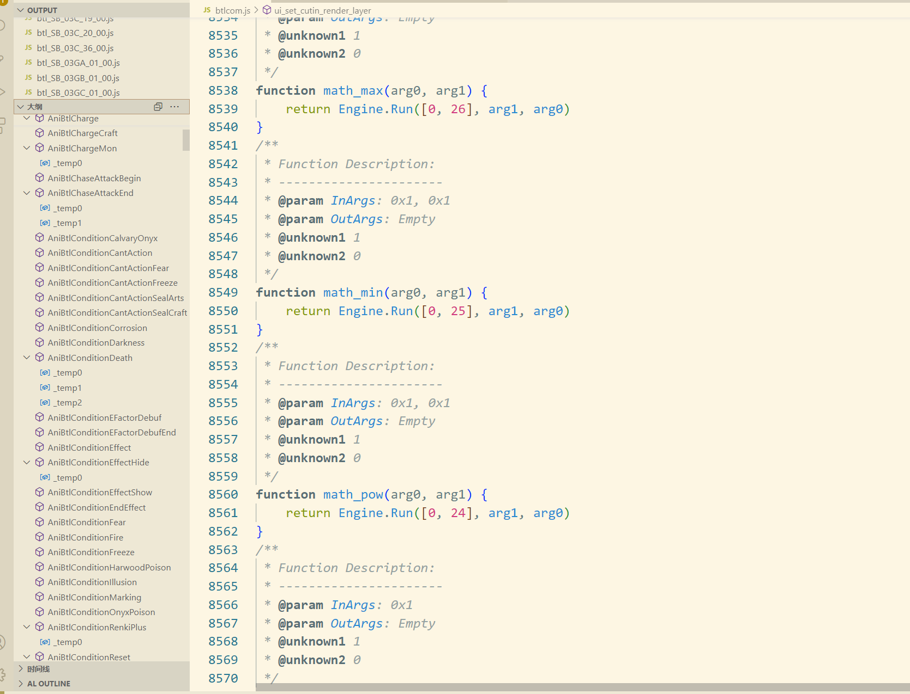

# KnKModTools - 界之轨迹修改工具
**Languages**: 
[简体中文](README.md) | 
[English](README.en.md) | 


一个用于修改《界之轨迹》数据表(.tbl)和脚本(.dat)文件的工具，使用C#开发，基于.NET 8框架。

## 目录
- [功能特性](#功能特性)
- [安装与使用](#安装与使用)
- [界面说明](#界面说明)
- [快捷键](#快捷键)
- [脚本修改](#脚本修改)
- [已知问题](#已知问题)
- [推荐工具](#推荐工具)
- [社区支持](#社区支持)
- [附录](#附录)

## 功能特性
- 编辑游戏数据表(.tbl文件)
- 反编译和重编译游戏脚本(.dat文件)
- 多语言支持（简体中文、繁体中文、韩文）
- 数据排序和快速编辑功能

## 安装与使用

### 系统要求
- Windows 7/10/11
- .NET 8运行时

### 使用步骤
1. 运行`KnKModTools.exe`
2. 首次启动需要进行以下设置：
   - 设置游戏安装目录
   - 设置脚本反编译后的输出目录
   - 设置table表语言（简体中文/繁体中文/韩文）
   - 设置程序语言


3. 等待程序加载完成
4. 当下方窗口显示操作界面后，即可开始编辑

**重要提示**：使用前请务必备份`script`和`table`相关目录！

## 界面说明



1. **tbl文件列表** - 显示所有可编辑的数据表文件
2. **节点列表** - 显示当前表的节点结构
3. **详细数据表** - 显示和编辑具体数据
4. **表头** - 点击可正序/倒序排序，切换节点还原顺序
5. **全部保存** - 保存所有修改
6. **反编译脚本** - 反编译脚本文件，输出到指定目录
7. **重编译脚本** - 重编译脚本文件，输出到指定目录

## 快捷键
- `左Ctrl + S` - 保存当前浏览的表
- 选中某一行 + `Ins` - 以该行为模板添加新项
- 选中某一行 + `Del` - 删除该项

## 脚本修改

### 反编译说明
反编译是一个复杂过程，虽然经过测试但无法保证100%准确。已进行以下测试验证：
- 即时战斗测试
- 回合战斗测试
- 过场动画测试
- 场景切换测试
- 打开宝箱测试

### JavaScript语法注意事项
- 使用基础JavaScript语法
- 逻辑反符号(!)无法使用，需使用`if(test){}else{...}`结构
- 跨脚本函数调用有两种形式：
  1. 常规形式：`sound_ani.SeBattleConfigDefault()`
  2. 带`sc_`前缀：`sc_this.AniFieldChargeAttack(Result[1])`
  
- 空脚本名(`""`)被替换为`All`
- `RUNCMD`指令包装为`Engine.Run([23, 38], arg)`形式




### 不可规约流图脚本
以下脚本包含不可规约流图（简体中文版）：
```
script_sc\ani\sound_ani.dat
    SeBattleMon0022
script_sc\ani\chr5117.dat
    AniBtlVoiceQuickArts
script_sc\minigame\basketball.dat
    SelectCharacter
script_sc\scena\a4000.dat
    Dummy_set_150
    Dummy_set_151
    Dummy_set_152
    Dummy_set_42
    Dummy_set_45
    Dummy_set_46
script_sc\scena\a0000.dat
    TestEmotion
script_sc\scena\sys_event.dat
    ReminiscenceCheckMenu
script_sc\scena\debug.dat
    FC_NoteBooks
```

## 已知问题
1. 带有换行的长文本可能显示不全，需复制出来修改后再粘贴回去
2. 暂未实现查找功能，但可通过排序快速定位
3. 源文件的字节对齐在保存时未处理（目前未发现影响游戏运行）

## 推荐工具
- [KuroTools](https://github.com/nnguyen259/KuroTools) - 数据表和脚本修改工具
- [kuro_mdl_tool](https://github.com/eArmada8/kuro_mdl_tool) - 模型处理工具
- [kuro_dlc_tool](https://github.com/eArmada8/kuro_dlc_tool) - DLC处理工具

## 社区支持
- Discord交流群组: [https://discord.gg/QdEYC6Cd](https://discord.gg/QdEYC6Cd)
- 轨迹系列中文社区: [茶会](https://trails-game.com/)

## 附录

### 指令表
| 十进制 | 指令名                        | 参数说明              | 栈变化 |
|-------|-------------------------------|-----------------------|--------|
| 0     | PUSH                          | (size=4, value)       | +1     |
| 1     | POP                           | bytes_to_pop (4倍数)  | -(n)   |
| 2     | RETRIEVEELEMENTATINDEX        | 字节偏移量（负值）    | +1     |
| 3     | RETRIEVEELEMENTATINDEX2       | 字节偏移量（负值）    | +1     |
| 4     | PUSHCONVERTINTEGER            | 目标字节偏移量（负值）| +1     |
| 5     | PUTBACKATINDEX                | 目标字节偏移量（负值）| -1     |
| 6     | PUTBACK                       | 目标字节偏移量（负值）| -1     |
| 7     | LOAD32                        | 全局变量索引          | +1     |
| 8     | STORE32                       | 全局变量索引          | -1     |
| 9     | LOADRESULT                    | 结果索引              | +1     |
| 10    | SAVERESULT                    | 结果索引              | -1     |
| 11    | JUMP                          | 目标地址（绝对偏移）  | 0      |
| 12    | CALL                          | 目标函数ID            | -(n+2) |
| 13    | EXIT                          | 无                    | 0      |
| 14    | JUMPIFTRUE                    | 目标地址（绝对偏移）  | -1     |
| 15    | JUMPIFFALSE                   | 目标地址（绝对偏移）  | -1     |
| 16-30 | 运算指令 (+ - * / == != 等)   | 无                    | -1     |
| 31    | NEGATIVE                      | 无                    | 0      |
| 32    | ISTRUE                        | 无                    | 0      |
| 33    | NOT                           | 无                    | 0      |
| 34    | CALLFROMANOTHERSCRIPT         | (脚本,函数,参数数)    | -(n+5) |
| 35    | CALLFROMANOTHERSCRIPT2        | (脚本,函数,参数数)    | -n     |
| 36    | RUNCMD                        | (cmd1, cmd2, 参数数)  | 0      |
| 37    | PUSHRETURNADDRESSFROMANOTHERSCRIPT | 返回地址 | +5     |
| 38    | ADDLINEMARKER                 | 调试标记              | 0      |
| 39    | POP2                          | 弹出元素个数          | -count |

### 运算指令对应表
```
[16] = ("+")
[17] = ("-")
[18] = ("*")
[19] = ("/")
[20] = ("%")
[21] = ("==")
[22] = ("!=")
[23] = (">")
[24] = (">=")
[25] = ("<")
[26] = ("<=")
[27] = ("&")
[28] = ("|")
[29] = ("&&")
[30] = ("||")
```
